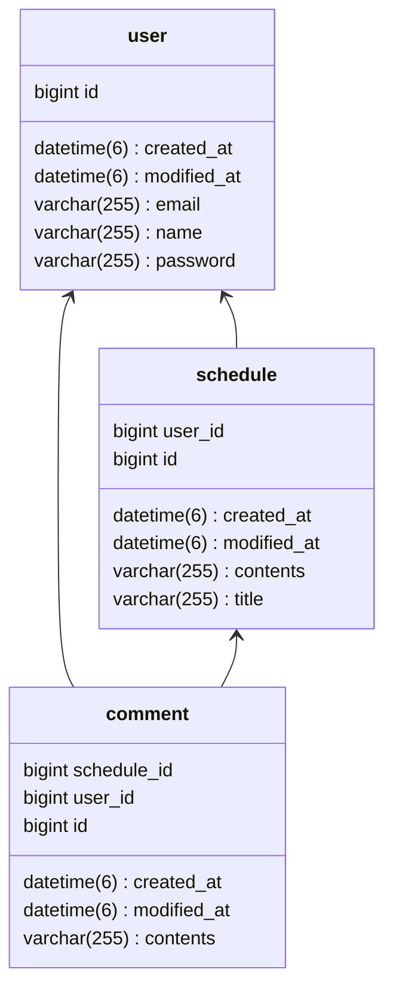

# 일정 관리 앱 - Develop API 명세서
## 1. 공통 정보

- **요청/응답 포맷**: `application/json`
- **비고:** `userId`는 클라이언트에서 전달하지 않으며, 서버에서 로그인 세션 정보를 통해 자동으로 처리됩니다.

---
## 2. 유저(User) API

### 2.1 회원가입

- **URL:** `POST /users/signup`
- **설명:** 새로운 유저를 생성합니다.

**Request Body (JSON)**

```json
{
	"name": "철수",
	"email": "su@google.com",
	"password": "1234"
}
```

| 필드명 | 타입 | 필수 | 설명 |
| --- | --- | --- | --- |
| name | String | O | 유저명 |
| email | String | O | 이메일 |
| password | String | O | 비밀번호 (암호화 전) |

**Response**

- **성공 (201 Created):**

```json
{
    "id": 1,
    "name": "철수",
    "email": "su@google.com",
    "createdAt": "2025-08-13T17:44:19.1349398",
    "modifiedAt": "2025-08-13T17:44:19.1349398"
}
```

| 필드명 | 타입 | 설명        |
| --- | --- |-----------|
| id | Long | 생성된 유저 ID |
| name | String | 유저명       |
| email | String | 이메일       |
| createdAt | LocalDateTime | 생성 시각     |
| modifiedAt | LocalDateTime | 수정 시각     |
- **실패 (400 Bad Request):**

```json
{
    "code": "INVALID_PARAMETER",
    "message": "요청이 올바르지 않습니다.",
    "errors": [
        {
            "field": "password",
            "message": "비밀번호를 입력해주세요."
        },
        {
            "field": "name",
            "message": "이름을 입력해주세요."
        },
        {
            "field": "name",
            "message": "이름은 2자 이상 18자 이하로 입력해주세요."
        },
        {
            "field": "email",
            "message": "올바른 형식의 이메일 주소여야 합니다"
        },
        {
            "field": "email",
            "message": "이메일 주소를 입력해주세요."
        },
        {
            "field": "password",
            "message": "비밀번호는 4자 이상 20자 이하로 입력해주세요"
        }
    ]
}
```

- **실패 (409 Conflict):**

```json
{
    "code": "EMAIL_DUPLICATION",
    "message": "이미 사용 중인 이메일입니다."
}
```

---

### 2.2 로그인

- **URL:** `POST /users/login`
- **설명:** 서버에 저장된 유저의 로그인을 실행합니다.

**Request**

- **Body (JSON)**

```json
{
	"email": "su@google.com",
	"password": "1234"
}
```

| 필드명 | 타입 | 필수 | 설명 |
| --- | --- | --- | --- |
| email | String | O | 이메일 |
| password | String | O | 비밀번호 (암호화 전) |

**Response**

- **성공 (200 OK):**
  - 응답 본문 없음
- **실패 (400 Bad Request):**

```json
{
    "code": "INVALID_PARAMETER",
    "message": "요청이 올바르지 않습니다.",
    "errors": [
        {
            "field": "email",
            "message": "올바른 형식의 이메일 주소여야 합니다"
        },
        {
            "field": "password",
            "message": "비밀번호는 4자 이상 20자 이하로 입력해주세요"
        },
        {
            "field": "password",
            "message": "비밀번호를 입력해주세요."
        },
        {
            "field": "email",
            "message": "이메일 주소를 입력해주세요."
        }
    ]
}
```

- **실패 (401 Unauthorized):**

```json
{
    "code": "PASSWORD_MISMATCH",
    "message": "비밀번호가 일치하지 않습니다."
}
```

- **실패 (404 Not Found):**

```json
{
    "code": "USER_NOT_FOUND",
    "message": "사용자를 찾을 수 없습니다."
}
```

---

### 2.3 유저 전체 조회

- **URL:** `GET /users`
- **설명:** 모든 유저 목록을 조회합니다.

**Response**

- **성공 (200 OK):**

```json
[
    {
        "id": 1,
        "name": "철수",
        "email": "su@google.com",
        "createdAt": "2025-08-13T17:44:19.13494",
        "modifiedAt": "2025-08-13T17:44:19.13494"
    },
    {
        "id": 2,
        "name": "홍길동",
        "email": "hong@google.com",
        "createdAt": "2025-08-13T17:53:44.515393",
        "modifiedAt": "2025-08-13T17:53:44.515393"
    }
]
```

| 필드명 | 타입 | 설명 |
| --- | --- | --- |
| id | Long | 유저 ID |
| name | String | 유저명 |
| email | String | 이메일 |
| createdAt | LocalDateTime | 생성 시각 |
| modifiedAt | LocalDateTime | 수정 시각 |

---

### 2.4 유저 단건 조회

- **URL:** `GET /users/{userId}`
- **설명:** 특정 유저의 정보를 조회합니다.

**PathVariable**

| 필드명 | 타입 | 필수 | 설명 |
| --- | --- | --- | --- |
| userId | Long | O | 조회할 유저의 ID |

**Response**

- **성공 (200 OK):**

```json
{
    "id": 1,
    "name": "철수",
    "email": "su@google.com",
    "createdAt": "2025-08-13T17:44:19.13494",
    "modifiedAt": "2025-08-13T17:44:19.13494"
}
```

- **실패 (404 Not Found):**

```json
{
    "code": "USER_NOT_FOUND",
    "message": "사용자를 찾을 수 없습니다."
}
```

---

### 2.5 유저 수정

- **URL:** `PUT /users/{userId}`
- **설명:** 특정 유저의 이름과 이메일 정보를 수정합니다.
  - 로그인한 본인만 자신의 정보를 수정할 수 있습니다.

**PathVariable**

| 이름 | 타입 | 필수 | 설명 |
| --- | --- | --- | --- |
| userId | Long | O | 수정할 유저의 ID |

**Request Body (JSON)**

```json
{
  "name": "김철수",
  "email": "suKim@google.com"
}
```

| 필드명 | 타입 | 필수 | 설명 |
| --- | --- | --- | --- |
| name | String | O | 수정할 유저명 |
| email | String | O | 수정할 이메일 |

**Response**

- **성공 (200 OK):**

```json
{
    "id": 1,
    "name": "김철수",
    "email": "suKim@google.com",
    "createdAt": "2025-08-13T17:44:19.13494",
    "modifiedAt": "2025-08-13T17:44:19.13494"
}
```

- **실패 (400 Bad Request):**

```json
{
    "code": "INVALID_PARAMETER",
    "message": "요청이 올바르지 않습니다.",
    "errors": [
        {
            "field": "name",
            "message": "이름을 입력해주세요."
        },
        {
            "field": "email",
            "message": "이메일 주소를 입력해주세요."
        },
        {
            "field": "name",
            "message": "이름은 2자 이상 18자 이하로 입력해주세요."
        },
        {
            "field": "email",
            "message": "올바른 형식의 이메일 주소여야 합니다"
        }
    ]
}
```

- **실패 (403 Forbidden):**

```json
{
    "code": "ACCESS_DENIED",
    "message": "요청한 리소스에 대한 접근 권한이 없습니다."
}
```

- **실패 (404 Not Found):**

```json
{
    "code": "USER_NOT_FOUND",
    "message": "사용자를 찾을 수 없습니다."
}
```

- **실패 (409 Conflict):**

```json
{
    "code": "EMAIL_DUPLICATION",
    "message": "이미 사용 중인 이메일입니다."
}
```

---

### 2.6 유저 삭제

- **URL:** `DELETE /users/{userId}`
- **설명:** 특정 유저를 삭제합니다.
  - 로그인한 본인만 계정을 삭제할 수 있습니다.

**Path Variable**

| 이름 | 타입 | 필수 | 설명 |
| --- | --- | --- | --- |
| userId | Long | O | 삭제할 유저의 ID |

**Response**

- **성공 (200 OK)**
  - 응답 본문 없음
- **실패 (403 Forbidden):**

```json
{
    "code": "ACCESS_DENIED",
    "message": "요청한 리소스에 대한 접근 권한이 없습니다."
}
```

- **실패 (404 Not Found):**

```json
{
    "code": "USER_NOT_FOUND",
    "message": "사용자를 찾을 수 없습니다."
}
```
---

## **3. 일정(Schedule) API**

### 3.1 일정 생성

- **URL:** `POST /schedules`
- **설명:** 새로운 일정을 생성합니다.

**Request**

- **Body (JSON)**

```json
{
	"title": "과제 제출",
	"contents": "14시까지 과제 제출하기"
}
```

| 필드명 | 타입 | 필수 | 설명 |
| --- | --- | --- | --- |
| title | String | O | 일정 제목 |
| contents | String | O | 일정 내용 |

**Response**

- **성공 (201 Created):**

```json
{
    "id": 1,
    "title": "과제 제출",
    "contents": "14시까지 과제 제출하기",
    "createdAt": "2025-08-13T18:15:18.9939005",
    "modifiedAt": "2025-08-13T18:15:18.9939005",
    "userId": 1
}
```

| 필드명 | 타입 | 설명 |
| --- | --- | --- |
| id | Long | 생성된 일정의 고유 ID |
| title | String | 일정 제목 |
| contents | String | 일정 내용 |
| createdAt | LocalDateTime | 생성 시각 |
| modifiedAt | LocalDateTime | 수정 시각  |
| userId | Long | 작성 유저 ID |
- **실패 (400 Bad Request):**

```json
{
    "code": "INVALID_PARAMETER",
    "message": "요청이 올바르지 않습니다.",
    "errors": [
        {
            "field": "title",
            "message": "제목을 입력해주세요."
        },
        {
            "field": "contents",
            "message": "내용을 입력해주세요."
        }
    ]
}
```

---

### 3.2 일정 전체 조회

- **URL:** `GET /schedules`
- **설명:** 등록된 모든 일정을 페이징 처리하여 수정일을 기준으로 내림차순 하여 조회합니다.

**Query Params**

| 필드명 | 타입 | 디폴트 | 설명 |
| --- | --- | --- | --- |
| page | int | 0 | 현재 페이지 |
| size | int | 10 | 페이지 개수 |

**Response**

- **성공 (200 OK):**

```json
[
    {
        "id": 3,
        "title": "TIL 작성",
        "contents": "블로그에 TIL할 작성하며 학습내용 리마인드",
        "commentCount": 0,
        "createdAt": "2025-08-13T18:22:38.500014",
        "modifiedAt": "2025-08-13T18:22:38.500014",
        "name": "홍길동"
    },
    {
        "id": 2,
        "title": "Spring 공부",
        "contents": "ERD 연관관계 공부하기",
        "commentCount": 0,
        "createdAt": "2025-08-13T18:16:47.404303",
        "modifiedAt": "2025-08-13T18:16:47.404303",
        "name": "철수"
    },
    {
        "id": 1,
        "title": "과제 제출",
        "contents": "14시까지 과제 제출하기",
        "commentCount": 1,
        "createdAt": "2025-08-13T18:15:18.993901",
        "modifiedAt": "2025-08-13T18:15:18.993901",
        "name": "철수"
    }
]
```

| 필드명 | 타입 | 설명 |
| --- | --- | --- |
| id | Long | 일정 ID |
| title | String | 일정 제목 |
| contents | String | 일정 내용 |
| commentCount | int | 댓글 개수 |
| createdAt | LocalDateTime | 생성 시각 |
| modifiedAt | LocalDateTime | 수정 시각 |
| name | String | 작성자명 |

---

### 3.3 일정 단건 조회

- **URL:** `GET /schedules/{scheduleId}`
- **설명:** 특정 일정을 조회합니다. 
  - 댓글 내용을 포함합니다.
  - 댓글은 페이징 처리하여 수정일을 기준으로 내림차순합니다.

**Path Variable:**

| 필드명 | 타입 | 필수 | 설명 |
| --- | --- | --- | --- |
| scheduleId | Long | O | 조회할 일정의 ID |

**Query Params**

| 필드명 | 타입 | 디폴트 | 설명 |
| --- | --- | --- | --- |
| page | int | 0 | 현재 페이지 |
| size | int | 10 | 페이지 개수 |

**Response**

- **성공 (200 OK):**

```json
{
    "id": 1,
    "title": "과제 제출",
    "contents": "14시까지 과제 제출하기",
    "userId": 1,
    "createdAt": "2025-08-13T18:15:18.993901",
    "modifiedAt": "2025-08-13T18:15:18.993901",
    "comments": [
        {
            "contents": "화이팅!",
            "name": "철수",
            "createdAt": "2025-08-13T18:19:23.722074",
            "modifiedAt": "2025-08-13T18:19:23.722074"
        }
    ]
}
```

| 필드명 | 타입 | 설명 |
| --- | --- | --- |
| id | Long | 일정 ID |
| title | String | 일정 제목 |
| contents | String | 일정 내용 |
| userId | Long | 작성자 ID |
| createdAt | LocalDateTime | 생성 시각 |
| modifiedAt | LocalDateTime | 수정 시각 |
| comments | List | 댓글 내용 |
- **실패 (404 Not Found):**

```json
{
    "code": "SCHEDULE_NOT_FOUND",
    "message": "요청한 일정을 찾을 수 없습니다."
}
```

---

### 3.4 일정 수정

- **URL:** `PUT /schedules/{scheduleId}`
- **설명:** 특정 일정의 제목과 내용을 수정합니다.

**Path Variable:**

| 필드명 | 타입 | 필수 | 설명 |
| --- | --- | --- | --- |
| scheduleId | Long | O | 수정할 일정의 ID |

**Request**

- **Body (JSON)**

```json
{
	"title": "과제 제출 전 검토",
	"contents": "14시 제출 전에 꼭 검토"
}
```

| 필드명 | 타입 | 필수 | 설명 |
| --- | --- | --- | --- |
| title | String | O | 수정할 제목 |
| contents | String | O | 수정할 내용 |

**Response**

- **성공 (200 OK):**

```json
{
    "id": 1,
    "title": "과제 제출 전 검토",
    "contents": "14시 제출 전에 꼭 검토",
    "createdAt": "2025-08-13T18:15:18.993901",
    "modifiedAt": "2025-08-13T18:29:14.683553",
    "userId": 1
}
```

| 필드명 | 타입 | 설명 |
| --- | --- | --- |
| id | Long | 일정 ID |
| title | String | 일정 제목 |
| contents | String | 일정 내용 |
| createdAt | LocalDateTime | 생성 시간 |
| modifiedAt | LocalDateTime | 수정 시간  |
| userId | Long | 작성자 ID |
- **실패 (400 Bad Request):**

```json
{
    "code": "INVALID_PARAMETER",
    "message": "요청이 올바르지 않습니다.",
    "errors": [
        {
            "field": "contents",
            "message": "내용을 입력해주세요."
        },
        {
            "field": "title",
            "message": "제목을 입력해주세요."
        }
    ]
}
```

- **실패 (404 Not Found):**

```json
{
    "code": "SCHEDULE_NOT_FOUND",
    "message": "요청한 일정을 찾을 수 없습니다."
}
```

- **실패 (403 Forbidden):**

```json
{
    "code": "ACCESS_DENIED",
    "message": "요청한 리소스에 대한 접근 권한이 없습니다."
}
```

---

### 3.5 일정 삭제

- **URL:** `DELETE /schedules/{scheduleId}`
- **설명:** 특정 일정을 삭제합니다.

**Path Variable:**

| 필드명 | 타입 | 필수 | 설명 |
| --- | --- | --- | --- |
| scheduleId | Long | O | 삭제할 일정의 ID |

**Response**

- **성공 (2OO OK)**
    - 응답 본문 없음

- **실패  (404 Not Found):**

```json
{
  "code": "SCHEDULE_NOT_FOUND",
  "message": "요청한 일정을 찾을 수 없습니다."
}
```

---

## 4. 댓글(Comment) API

### 4.1 댓글 생성

- **URL:** `POST /schedules/{scheduleId}/comments`
- **설명:** 특정 일정에 댓글을 등록합니다.

**Path Variable**

| 이름 | 타입 | 필수 | 설명 |
| --- | --- | --- | --- |
| scheduleId | Long | O | 일정 고유 식별자 |

**Request**

- **Body (JSON)**

```json
{
	"contents": "스트레칭 하면서 합시다"
}
```

| 필드명 | 타입 | 필수 | 설명 |
| --- | --- | --- | --- |
| contents | String | O | 댓글내용 |

**Response**

- **성공 (201 Created):**

```json
 {
    "id": 2,
    "contents": "스트레칭 하면서 합시다",
    "createdAt": "2025-08-13T18:39:17.205318",
    "modifiedAt": "2025-08-13T18:39:17.205318",
    "userId": 1,
    "scheduleId": 1
}
```

| 필드명 | 타입 | 설명 |
| --- | --- | --- |
| id | Long | 생성된 댓글의 고유 ID |
| contents | String | 댓글 내용 |
| createdAt | LocalDateTime | 작성 시각 |
| modifiedAt | LocalDateTime | 수정 시각  |
| userId | Long | 작성자 ID |
| scheduleId | Long | 일정 고유 식별자 |
- **실패 (400 Bad Request):**

```json
{
    "code": "INVALID_PARAMETER",
    "message": "요청이 올바르지 않습니다.",
    "errors": [
        {
            "field": "contents",
            "message": "내용을 입력해주세요."
        }
    ]
}
```

- **실패 (404 Not Found):**

```json
{
    "code": "SCHEDULE_NOT_FOUND",
    "message": "요청한 일정을 찾을 수 없습니다."
}
```

---

### 4.2 일정 별 댓글 조회

- **URL:** `GET /schedules/{scheduleId}/comments`
- **설명:** 특정 일정의 댓글 목록을 조회합니다.

**Path Variable**

| 이름 | 타입 | 필수 | 설명 |
| --- | --- | --- | --- |
| scheduleId | Long | O | 일정 고유 식별자 |

**Response**

- **성공 (200 OK):**

```json
[
    {
        "id": 1,
        "contents": "화이팅!",
        "createdAt": "2025-08-13T18:19:23.722074",
        "modifiedAt": "2025-08-13T18:19:23.722074",
        "userId": 1,
        "scheduleId": 1
    },
    {
        "id": 2,
        "contents": "스트레칭 하면서 합시다",
        "createdAt": "2025-08-13T18:39:17.205318",
        "modifiedAt": "2025-08-13T18:39:17.205318",
        "userId": 1,
        "scheduleId": 1
    }
]
```

- **실패 (404 Not Found):**

```json
{
    "code": "SCHEDULE_NOT_FOUND",
    "message": "요청한 일정을 찾을 수 없습니다."
}
```

---

### 4.3 댓글 수정

- **URL:** `PUT /schedules/{scheduleId}/comments/{commentId}`
- **설명:** 특정 일정의 댓글 내용을 수정합니다.

**Path Variable**

| 이름 | 타입 | 필수 | 설명 |
| --- | --- | --- | --- |
| scheduleId | Long | O | 일정 고유 식별자 |
| commentId | Long | O | 댓글 고유 식별자 |

**Request**

- **Body (JSON)**

```json
{
	"contents": "물 많이 드세요"
}
```

| 필드명 | 타입 | 필수 | 설명 |
| --- | --- | --- | --- |
| contents | String | O | 댓글내용 |

**Response**

- **성공 (200 OK):**

```json
{
    "id": 1,
    "contents": "물 많이 드세요",
    "createdAt": "2025-08-13T18:19:23.722074",
    "modifiedAt": "2025-08-13T18:46:10.3311809",
    "userId": 1,
    "scheduleId": 1
}
```

| 필드명 | 타입 | 설명 |
| --- | --- | --- |
| id | Long | 생성된 댓글의 고유 ID |
| contents | String | 댓글 내용 |
| createdAt | LocalDateTime | 작성 시각 |
| modifiedAt | LocalDateTime | 수정 시각  |
| userId | Long | 작성자 ID |
| scheduleId | Long | 일정 고유 식별자 |
- **실패 (400 Bad Request):**

```json
{
    "code": "INVALID_PARAMETER",
    "message": "요청이 올바르지 않습니다.",
    "errors": [
        {
            "field": "contents",
            "message": "내용을 입력해주세요."
        }
    ]
}
```

- **실패 (404 Not Found):**

```json
{
    "code": "SCHEDULE_NOT_FOUND",
    "message": "요청한 일정을 찾을 수 없습니다."
}
```

---

### 4.4 댓글 삭제

- **URL:** `DELETE /schedules/{scheduleId}/comments/{commentId}"`
- **설명:** 특정 댓글를 삭제합니다.

**Path Variable**

| 이름 | 타입 | 필수 | 설명 |
| --- | --- | --- | --- |
| scheduleId | Long | O | 일정 고유 식별자 |
| commentId | Long | O | 댓글 고유 식별자 |

**Response**

- **성공 (200 OK)**
    - 응답 본문 없음
- **실패 (403 Forbidden):**

```json
{
    "code": "ACCESS_DENIED",
    "message": "요청한 리소스에 대한 접근 권한이 없습니다."
}
```

- **실패 (404 Not Found):**

```json
{
    "code": "RESOURCE_NOT_FOUND",
    "message": "요청한 리소스를 찾을 수 없습니다."
}
```

---

## 5. 공통 오류 코드

| 코드                            | HTTP 상태          | 설명                                  | 비고                  |
| ----------------------------- | ---------------- | ----------------------------------- | ------------------- |
| `INVALID_PARAMETER`           | 400 Bad Request  | 요청 파라미터 유효성 검증 실패 (필수값 누락, 형식 오류 등) | 공통 validation 오류    |
| `RESOURCE_NOT_FOUND`          | 404 Not Found    | 요청한 리소스를 찾을 수 없음                    | 리소스 not found 공통 처리 |
| `ACCESS_DENIED`               | 403 Forbidden    | 요청한 리소스에 대한 접근 권한이 없음               | 권한 관련 오류            |
| `SESSION_NOT_FOUND`           | 401 Unauthorized | 유효한 세션이 존재하지 않음                     | 인증 실패               |
| `SESSION_ATTRIBUTE_NOT_FOUND` | 401 Unauthorized | 필요한 세션 속성이 존재하지 않음                  | 인증/세션 관련 오류         |
| `LOGIN_REQUIRED`              | 401 Unauthorized | 로그인이 필요함                            | 인증/세션 관련 오류         |

---


## 6. ERD (Mermaid Class Diagram)


